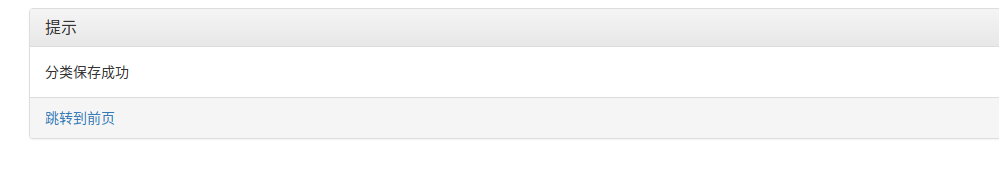

# 开发日记

### 2021/12/23

定下总体框架为学生的活动报名系统
引入管理员学生两个模块
引用github中css 的模块初始化index界面
##来自https://github.com/Wozhizxy/hnu_s-t_system

### 2021/12/26

重新选择index界面，并换了架构。选择一个活动管理系统。权限分为管理员和超级管理员，管理员可选择增删改活动，超级管理员可管理管理员账号的增删改。
来自大二web课程项目
ubuntu20.04黑屏无法开机，换了新系统
需要新的git仓库 名为FinalExa

### 2021/12/27

完成了所有前端页面的设计

### 2021/12/28

查阅资料并完成后端设计，将网页再次美化
（npm导入swig/cookies/body_parser)等

完整的功能测试等

检索功能未完成。

# 项目开发部分

## 1）项目设计

（1）总体上有两个模块构成，超级管理员登录时将比普通管理员多一个用户管理模块，

普通管理员可以增删改活动类别，具体活动。上方搜索框可以根据类别检索需要的活动/类别。

（2）引入的包在项目中的作用相关说明；

引用cooikes\swig\body—praser\express\mongoose

a)cooikes

使账号登陆之后时网站可以获取登陆信息，并在退出之前都可以持续获取信息，使网站中请求数据之时不用一直使用数据库

b）swig

Simplified Wrapper and Interface Generator (SWIG）

简化包装器和接口生成器

所有对开发人员的一个常见要求是向脚本语言接口公开 C/C++ 代码。

c)body——praser

可以读取网页中的字段值，配合cooikes使用完成登陆/数据采集等功能

d)express

网页路由

e)mongoose

便捷增删改连接mongodb的方法。

（3）项目目录结构和各个部分的说明。

## 2）使用说明书：

### 1.超级管理员

#### 1.1用户管理

### 2.普通管理员

#### 2.1活动分类管理

##### 2.1.1修改/删除

##### 2.1.2增加

#### 2.2具体活动管理

##### 2.2.1活动删改

##### 2.2.2活动增加

